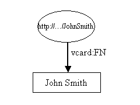

# RDF和Jena RDF API简介

## 前言

这是W3C的资源描述框架（RDF）和Rena的Java API Jena的教程介绍。它是为不熟悉RDF并通过原型学习或出于其他原因希望快速过渡到实施而学习得最好的程序员编写的。假定对XML和Java都有一定的了解。

在没有先了解RDF数据模型的情况下实施得太快会导致挫败感和失望感。然而，仅研究数据模型是干dry的事情，常常导致曲折的形而上学难题。最好同时了解数据模型和如何并行使用它。学习一些数据模型并尝试一下。然后了解更多并尝试一下。然后理论指导实践，实践指导理论。数据模型非常简单，因此这种方法不会花费很长时间。

RDF具有XML语法，因此许多熟悉XML的人都会从该语法的角度考虑RDF。这是个错误。应该从数据模型的角度来理解RDF。 RDF数据可以用XML表示，但是了解语法是了解数据模型的第二要务。

可以从以下位置下载Jena API的实现，包括本教程中所有示例的工作源代码。

## 目录
1. 介绍
2. 陈述
3. 编写RDF
4. 阅读RDF
5. 控制前缀
6. Jena RDF软件包
7. 导航模型
8. 查询模型
9. 模型操作
10. 货柜
11. 有关文字和数据类型的更多信息
12. 词汇表

## 1.介绍

资源描述框架（RDF）是用于描述资源的标准（技术上是W3C建议书）。 什么是资源？ 这是一个很深的问题，确切的定义仍然是辩论的主题。 就我们的目的而言，我们可以将其视为可以识别的任何事物。 您是本网站的资源，也是本教程的资源，它是Moby Dick的第一名和大白鲸。

本教程中的示例将与人有关。 他们使用VCARDS的RDF表示形式。 最好以节点图和弧形图的形式来考虑RDF。 在RDF中，一个简单的vcard可能看起来像这样：



资源John Smith以椭圆显示，并由统一资源标识符（URI）1标识，本例中为“ http：//.../JohnSmith”。如果尝试使用浏览器访问该资源，则成功的可能性不大； 4月的第一场笑话不胜枚举，如果您的浏览器能够将John Smith送到您的桌面，您会感到非常惊讶。如果您不熟悉URI，可以简单地将它们视为看起来很奇怪的名称。

资源具有属性。在这些示例中，我们对将出现在约翰·史密斯名片上的属性感兴趣。图1仅显示了一个属性，即John Smith的全名。属性由圆弧表示，并标有属性名称。属性的名称也是一个URI，但是由于URI相当长且麻烦，因此该图以XML qname形式显示了它。 '：'之前的部分称为名称空间前缀，表示名称空间。 '：'之后的部分称为本地名称，代表该名称空间中的名称。当以RDF XML格式编写时，属性通常以qname形式表示，这是在图形和文本中表示属性的便捷方式。但是，严格地，属性由URI标识。 nsprefix：localname形式是与本地名称连接的名称空间URI的简写。当浏览器访问时，不要求属性的URI解析为任何内容。

每个属性都有一个值。在这种情况下，值是文字，现在我们可以将其视为字符串2。文字以矩形显示。

Jena是一种Java API，可用于创建和操作RDF图。耶拿（Jena）有对象类来表示图，资源，属性和文字。表示资源，属性和文字的接口分别称为资源，属性和文字。在耶拿（Jena）中，图形称为模型，并由模型接口表示。

创建此图或模型的代码很简单：

```
// some definitions
static String personURI    = "http://somewhere/JohnSmith";
static String fullName     = "John Smith";

// create an empty Model
Model model = ModelFactory.createDefaultModel();

// create the resource
Resource johnSmith = model.createResource(personURI);

// add the property
 johnSmith.addProperty(VCARD.FN, fullName);
```

它以一些常量定义开始，然后使用ModelFactory方法createDefaultModel（）创建一个基于内存的模型，从而创建一个空的模型。 Jena包含Model接口的其他实现，例如使用关系数据库的实现：ModelFactory也提供这些类型的Model。

然后创建John Smith资源，并向其中添加属性。 该属性由“常量”类VCARD提供，该类保存表示VCARD架构中所有定义的对象。 Jena为其他众所周知的模式（例如RDF和RDF模式本身，Dublin Core和OWL）提供了常量类。

可以在Jena发行版的/ src-examples目录中以教程1的形式找到该示例的工作代码。作为练习，请使用此代码并对其进行修改以为自己创建一个简单的VCARD。

创建资源和添加属性的代码可以以级联样式更紧凑地编写：

```
Resource johnSmith =
        model.createResource(personURI)
             .addProperty(VCARD.FN, fullName);
```

现在，让我们向vcard添加更多详细信息，探索RDF和Jena的更多功能。

在第一个示例中，属性值为文字。 RDF属性还可以将其他资源用作其值。 此示例使用通用的RDF技术，展示了如何表示John Smith名称的不同部分：


在这里，我们添加了一个新属性vcard：N来表示约翰·史密斯名字的结构。 关于此模型，有几件有趣的事情。 请注意，vcard：N属性将资源作为其值。 还要注意，表示化合物名称的椭圆没有URI。 它被称为空白节点。

构造此示例的Jena代码再次非常简单。 首先，进行一些声明并创建空模型。

```
// some definitions
String personURI    = "http://somewhere/JohnSmith";
String givenName    = "John";
String familyName   = "Smith";
String fullName     = givenName + " " + familyName;

// create an empty Model
Model model = ModelFactory.createDefaultModel();

// create the resource
//   and add the properties cascading style
Resource johnSmith
  = model.createResource(personURI)
         .addProperty(VCARD.FN, fullName)
         .addProperty(VCARD.N,
                      model.createResource()
                           .addProperty(VCARD.Given, givenName)
                           .addProperty(VCARD.Family, familyName));
```

该示例的工作代码可以在Jena发行版的/ src-examples目录中的教程2中找到。

## 2. 陈述

RDF模型中的每个弧称为语句。每个语句都断言有关资源的事实。语句包含三个部分：

- 主题是弧线离开的资源
- 谓词是标记弧的属性
- 对象是弧所指向的资源或文字

一条语句有时由于三部分而被称为三元组。

RDF模型表示为一组语句。 tutorial2中的每个addProperty调用都向模型添加了另一个语句。 （因为Model是一组语句，所以添加语句的重复无效。）Jena模型接口定义了一个listStatements（）方法，该方法返回一个StmtIterator，它是Model中所有语句的Java Iterator的子类型。 StmtIterator有一个nextStatement（）方法，该方法从迭代器返回下一个语句（next（）将传递的该语句，已经强制转换为Statement）。 Statement接口为语句的主题，谓词和宾语提供访问器方法。

现在，我们将使用该接口来扩展tutorial2，以列出所有创建的语句并打印出来。完整的代码可以在教程3中找到。

```
// list the statements in the Model
StmtIterator iter = model.listStatements();

// print out the predicate, subject and object of each statement
while (iter.hasNext()) {
    Statement stmt      = iter.nextStatement();  // get next statement
    Resource  subject   = stmt.getSubject();     // get the subject
    Property  predicate = stmt.getPredicate();   // get the predicate
    RDFNode   object    = stmt.getObject();      // get the object

    System.out.print(subject.toString());
    System.out.print(" " + predicate.toString() + " ");
    if (object instanceof Resource) {
       System.out.print(object.toString());
    } else {
        // object is a literal
        System.out.print(" \"" + object.toString() + "\"");
    }

    System.out.println(" .");
}
```

由于语句的对象可以是资源或文字，因此getObject（）方法返回一个类型为RDFNode的对象，该对象是Resource和Literal的通用超类。 基础对象是适当的类型，因此代码使用instanceof来确定哪个对象并进行相应的处理。

运行时，此程序应产生类似以下的输出：

```
http://somewhere/JohnSmith http://www.w3.org/2001/vcard-rdf/3.0#N 413f6415-c3b0-4259-b74d-4bd6e757eb60 .
413f6415-c3b0-4259-b74d-4bd6e757eb60 http://www.w3.org/2001/vcard-rdf/3.0#Family  "Smith" .
413f6415-c3b0-4259-b74d-4bd6e757eb60 http://www.w3.org/2001/vcard-rdf/3.0#Given  "John" .
http://somewhere/JohnSmith http://www.w3.org/2001/vcard-rdf/3.0#FN  "John Smith" .
```
现在您知道了为什么绘制模型更加清晰。 如果仔细看，您会发现每一行包含三个字段，分别代表每个语句的主题，谓词和宾语。 模型中有四个弧，因此有四个语句。 “ 14df86：ecc3dee17b：-7fff”是耶拿生成的内部标识符。 它不是URI，不应与URI混淆。 它只是Jena实现使用的内部标签。

W3C RDFCore工作组已经定义了一个类似的简单符号，称为N-Triples。 该名称的意思是“三重表示法”。 在下一节中，我们将看到Jena内置了一个N-Triples编写器。

## 3. 写RDF

Jena提供了将RDF读取和写入XML的方法。 这些可用于将RDF模型保存到文件中，以后再读回。

教程3创建了一个模型并将其写成三重形式。 教程4修改了教程3，以RDF XML格式将模型写入标准输出流。 再次编写代码非常简单：model.write可以使用OutputStream参数。

```
// now write the model in XML form to a file
model.write(System.out);
```

输出应如下所示：

```
<rdf:RDF
  xmlns:rdf='http://www.w3.org/1999/02/22-rdf-syntax-ns#'
  xmlns:vcard='http://www.w3.org/2001/vcard-rdf/3.0#'
 >
  <rdf:Description rdf:about='http://somewhere/JohnSmith'>
    <vcard:FN>John Smith</vcard:FN>
    <vcard:N rdf:nodeID="A0"/>
  </rdf:Description>
  <rdf:Description rdf:nodeID="A0">
    <vcard:Given>John</vcard:Given>
    <vcard:Family>Smith</vcard:Family>
  </rdf:Description>
</rdf:RDF>
```

RDF规范指定如何将RDF表示为XML。 RDF XML语法非常复杂。读者可以参考RDFCore WG正在开发的入门手册，以进行更详细的介绍。但是，让我们快速看一下如何解释以上内容。

RDF通常嵌入在<rdf：RDF>元素中。如果有其他方法可以知道某些XML是RDF，则该元素是可选的，但是通常存在。 RDF元素定义了文档中使用的两个名称空间。然后有一个<rdf：Description>元素，它描述URI为“ http：// somewhere / JohnSmith”的资源。如果缺少rdf：about属性，则此元素将表示一个空白节点。

<vcard：FN>元素描述资源的属性。该属性名称是vcard命名空间中的“ FN”。 RDF通过将名称空间前缀和名称的本地名称部分“ FN”的URI参考串联起来，将其转换为URI参考。这给出了“ http://www.w3.org/2001/vcard-rdf/3.0#FN”的URI参考。该属性的值是文字“ John Smith”。

<vcard：N>元素是一种资源。在这种情况下，资源由相对URI引用表示。 RDF通过将其与当前文档的基本URI串联起来，将其转换为绝对URI引用。

该RDF XML中存在错误；它不完全代表我们创建的模型。已为模型中的空白节点提供了URI参考。它不再是空白。 RDF / XML语法不能表示所有RDF模型；例如，它不能表示作为两个语句的对象的空白节点。我们用来编写此RDF / XML的“哑”编写器没有尝试正确编写可以正确编写的Models子集。它为每个空白节点提供一个URI，使其不再空白。

Jena具有可扩展的接口，可以轻松插入用于RDF的不同序列化语言的新编写器。上述调用调用了标准的“哑”编写器。 Jena还包括一个更复杂的RDF / XML编写器，可以通过为write（）方法调用指定另一个参数来调用它：

```
// now write the model in XML form to a file
model.write(System.out, "RDF/XML-ABBREV");
```

这位作家，即所谓的PrettyWriter，利用RDF / XML缩写语法的功能来更紧凑地编写模型。 它还可以在可能的情况下保留空白节点。 但是，它不适合编写非常大的模型，因为它的性能不太可能被接受。 要写入大文件并保留空白节点，请以N-Triples格式写入：

```
// now write the model in N-TRIPLES form to a file
model.write(System.out, "N-TRIPLES");
```
这将产生类似于教程3的输出，该输出符合N-Triples规范。

## 4. 读RDF

教程5演示了将以RDF XML格式记录的语句读入模型。 在本教程中，我们以RDF / XML格式提供了一个小型vcard数据库。 以下代码将其读入并写出。 请注意，要运行此应用程序，输入文件必须位于当前目录中。

```
 // create an empty model
 Model model = ModelFactory.createDefaultModel();

 // use the FileManager to find the input file
 InputStream in = FileManager.get().open( inputFileName );
if (in == null) {
    throw new IllegalArgumentException(
                                 "File: " + inputFileName + " not found");
}

// read the RDF/XML file
model.read(in, null);

// write it to standard out
model.write(System.out);
```

read（）方法调用的第二个参数是URI，它将用于解析相对URI。 由于测试文件中没有相对的URI引用，因此可以将其为空。 运行时，教程5将产生XML输出，如下所示：

```
<rdf:RDF
  xmlns:rdf='http://www.w3.org/1999/02/22-rdf-syntax-ns#'
  xmlns:vcard='http://www.w3.org/2001/vcard-rdf/3.0#'
 >
  <rdf:Description rdf:nodeID="A0">
    <vcard:Family>Smith</vcard:Family>
    <vcard:Given>John</vcard:Given>
  </rdf:Description>
  <rdf:Description rdf:about='http://somewhere/JohnSmith/'>
    <vcard:FN>John Smith</vcard:FN>
    <vcard:N rdf:nodeID="A0"/>
  </rdf:Description>
  <rdf:Description rdf:about='http://somewhere/SarahJones/'>
    <vcard:FN>Sarah Jones</vcard:FN>
    <vcard:N rdf:nodeID="A1"/>
  </rdf:Description>
  <rdf:Description rdf:about='http://somewhere/MattJones/'>
    <vcard:FN>Matt Jones</vcard:FN>
    <vcard:N rdf:nodeID="A2"/>
  </rdf:Description>
  <rdf:Description rdf:nodeID="A3">
    <vcard:Family>Smith</vcard:Family>
    <vcard:Given>Rebecca</vcard:Given>
  </rdf:Description>
  <rdf:Description rdf:nodeID="A1">
    <vcard:Family>Jones</vcard:Family>
    <vcard:Given>Sarah</vcard:Given>
  </rdf:Description>
  <rdf:Description rdf:nodeID="A2">
    <vcard:Family>Jones</vcard:Family>
    <vcard:Given>Matthew</vcard:Given>
  </rdf:Description>
  <rdf:Description rdf:about='http://somewhere/RebeccaSmith/'>
    <vcard:FN>Becky Smith</vcard:FN>
    <vcard:N rdf:nodeID="A3"/>
  </rdf:Description>
</rdf:RDF>
```

## 5. 控制前缀

### 明确的前缀定义

在上一节中，我们看到了输出XML声明了一个名称空间前缀vcard，并使用该前缀来缩写URI。 尽管RDF仅使用完整的URI，而不使用这种缩短的形式，但Jena提供了使用前缀映射来控制用于输出的名称空间的方法。 这是一个简单的例子。

```
Model m = ModelFactory.createDefaultModel();
 String nsA = "http://somewhere/else#";
 String nsB = "http://nowhere/else#";
 Resource root = m.createResource( nsA + "root" );
 Property P = m.createProperty( nsA + "P" );
 Property Q = m.createProperty( nsB + "Q" );
 Resource x = m.createResource( nsA + "x" );
 Resource y = m.createResource( nsA + "y" );
 Resource z = m.createResource( nsA + "z" );
 m.add( root, P, x ).add( root, P, y ).add( y, Q, z );
 System.out.println( "# -- no special prefixes defined" );
 m.write( System.out );
 System.out.println( "# -- nsA defined" );
 m.setNsPrefix( "nsA", nsA );
 m.write( System.out );
 System.out.println( "# -- nsA and cat defined" );
 m.setNsPrefix( "cat", nsB );
 m.write( System.out );
```

该片段的输出是三批RDF / XML，带有三个不同的前缀映射。 首先是默认值，除了标准前缀外没有其他前缀：

```
# -- no special prefixes defined

<rdf:RDF
    xmlns:j.0="http://nowhere/else#"
    xmlns:rdf="http://www.w3.org/1999/02/22-rdf-syntax-ns#"
    xmlns:j.1="http://somewhere/else#" >
  <rdf:Description rdf:about="http://somewhere/else#root">
    <j.1:P rdf:resource="http://somewhere/else#x"/>
    <j.1:P rdf:resource="http://somewhere/else#y"/>
  </rdf:Description>
  <rdf:Description rdf:about="http://somewhere/else#y">
    <j.0:Q rdf:resource="http://somewhere/else#z"/>
  </rdf:Description>
</rdf:RDF>
```

我们看到rdf名称空间是自动声明的，因为<rdf：RDF>和<rdf：resource>之类的标记需要它。 使用两个属性P和Q还需要XML命名空间声明，但是由于在此示例中未将其前缀引入模型，因此它们获得了发明的命名空间名称：j.0和j.1。

方法setNsPrefix（String prefix，String URI）声明名称空间URI可以由前缀缩写。 Jena要求前缀必须是合法的XML名称空间名称，并且URI以非名称字符结尾。 RDF / XML编写器会将这些前缀声明转换为XML名称空间声明，并在其输出中使用它们：

```
# -- nsA defined

<rdf:RDF
    xmlns:j.0="http://nowhere/else#"
    xmlns:rdf="http://www.w3.org/1999/02/22-rdf-syntax-ns#"
    xmlns:nsA="http://somewhere/else#" >
  <rdf:Description rdf:about="http://somewhere/else#root">
    <nsA:P rdf:resource="http://somewhere/else#x"/>
    <nsA:P rdf:resource="http://somewhere/else#y"/>
  </rdf:Description>
  <rdf:Description rdf:about="http://somewhere/else#y">
    <j.0:Q rdf:resource="http://somewhere/else#z"/>
  </rdf:Description>
</rdf:RDF>
```

另一个名称空间仍获得构造的名称，但是nsA名称现在在属性标记中使用。 前缀名称与Jena代码中的变量没有任何关系：

```
# -- nsA and cat defined

<rdf:RDF
    xmlns:cat="http://nowhere/else#"
    xmlns:rdf="http://www.w3.org/1999/02/22-rdf-syntax-ns#"
    xmlns:nsA="http://somewhere/else#" >
  <rdf:Description rdf:about="http://somewhere/else#root">
    <nsA:P rdf:resource="http://somewhere/else#x"/>
    <nsA:P rdf:resource="http://somewhere/else#y"/>
  </rdf:Description>
  <rdf:Description rdf:about="http://somewhere/else#y">
    <cat:Q rdf:resource="http://somewhere/else#z"/>
  </rdf:Description>
</rdf:RDF>
```

这两个前缀都用于输出，并且不需要生成的前缀。

### 隐式前缀定义

除了调用setNsPrefix所提供的前缀声明外，Jena还将记住在model.read（）输入中使用的前缀。
取上一个片段产生的输出，并将其粘贴到某个文件中，并用URL文件：/tmp/fragment.rdf表示。 然后运行代码：

```
Model m2 = ModelFactory.createDefaultModel();
m2.read( "file:/tmp/fragment.rdf" );
m2.write( System.out );
```

您会看到输入中的前缀保留在输出中。 即使没有在任何地方使用它们，所有的前缀也会被写入。 如果不想在输出中使用前缀，可以使用removeNsPrefix（String prefix）删除前缀。
由于NTriples没有编写URI的任何简便方法，因此它不会注意输出的前缀，也不会提供输入的前缀。 耶拿（Nena）也支持符号N3，它确实具有短前缀名称，并将其记录在输入中并在输出中使用它们。

Jena对模型所拥有的前缀映射进行了进一步的操作，例如提取现有映射的Java Map或一次添加整组映射。 有关详细信息，请参见PrefixMapping文档。


## Jena RDF 包

Jena是用于语义Web应用程序的Java API。应用程序开发人员的主要RDF包是org.apache.jena.rdf.model。该API已根据接口进行了定义，因此应用程序代码可以在不更改的情况下与不同的实现一起使用。该软件包包含用于表示模型，资源，属性，文字，语句和RDF的所有其他关键概念的接口，以及用于创建模型的ModelFactory。为了使应用程序代码独立于实现，最好是尽可能使用接口而不是特定的类实现。

org.apache.jena.tutorial软件包包含本教程中使用的所有示例的有效源代码。

org.apache.jena ... impl软件包包含实现类，这些实现类可能是许多实现所共有的。例如，它们定义了类ResourceImpl，PropertyImpl和LiteralImpl，它们可以直接使用或由不同的实现子类化。应用程序很少（如果有的话）直接使用这些类。例如，与其创建新的ResourceImpl实例，不如使用任何正在使用的模型的createResource方法。这样，如果模型实现使用了Resource的优化实现，则无需在两种类型之间进行转换。

## 导航一个 Model

到目前为止，本教程主要涉及创建，读取和编写RDF模型。 现在是时候处理访问模型中保存的信息了。

给定资源的URI，可以使用Model.getResource（String uri）方法从模型中检索资源对象。 定义此方法以返回Resource对象（如果模型中存在对象），否则创建一个新对象。 例如，要从模型中检索John Smith资源，请从教程5中的文件中读取：

```
// retrieve the John Smith vcard resource from the model
Resource vcard = model.getResource(johnSmithURI);
```

Resource接口定义了许多用于访问资源属性的方法。 Resource.getProperty（Property p）方法访问资源的属性。 此方法不遵循通常的Java访问器约定，因为返回的对象类型是Statement，而不是您可能期望的Property。 返回整个语句允许应用程序使用其访问器方法之一访问该属性的值，该方法返回该语句的对象。 例如，要检索作为vcard：N属性值的资源：

```
// retrieve the value of the N property
Resource name = (Resource) vcard.getProperty(VCARD.N)
                                .getObject();
```

通常，语句的对象可以是资源或文字，因此知道值必须是资源的应用程序代码将转换返回的对象。 Jena尝试做的一件事是提供特定于类型的方法，这样应用程序就不必强制转换，并且可以在编译时进行类型检查。 上面的代码片段，可以更方便地编写：

```
// retrieve the value of the N property
Resource name = vcard.getProperty(VCARD.N)
                     .getResource();
```

同样，可以检索属性的文字值：

```
// retrieve the given name property
String fullName = vcard.getProperty(VCARD.FN)
                        .getString();
```

在此示例中，vcard资源仅具有一个vcard：FN和一个vcard：N属性。 RDF允许资源重复属性； 例如，亚当可能有多个绰号。 我们给他两个：

```
// add two nickname properties to vcard
vcard.addProperty(VCARD.NICKNAME, "Smithy")
     .addProperty(VCARD.NICKNAME, "Adman");
```

如前所述，Jena将RDF模型表示为一组语句，因此添加带有主语，谓语和宾语作为该模型中已有语句的语句将无效。 耶拿（Jena）并未定义模型中存在的两个昵称中的哪个昵称。 调用vcard.getProperty（VCARD.NICKNAME）的结果不确定。 耶拿将返回值之一，但即使两次连续调用都将返回相同值，也无法保证。

如果一个属性可能出现多次，则可以使用Resource.listProperties（Property p）方法返回一个迭代器，该迭代器将列出所有这些属性。 此方法返回一个迭代器，该迭代器返回Statement类型的对象。 我们可以列出这样的昵称：

```
// set up the output
System.out.println("The nicknames of \""
                      + fullName + "\" are:");
// list the nicknames
StmtIterator iter = vcard.listProperties(VCARD.NICKNAME);
while (iter.hasNext()) {
    System.out.println("    " + iter.nextStatement()
                                    .getObject()
                                    .toString());
}
```

可以在教程6中找到该代码。语句迭代器iter生成带有主题vcard和谓词VCARD.NICKNAME的每个语句，因此对其进行循环允许我们使用nextStatement（）获取每个语句，获取对象字段，并进行转换 它到一个字符串。 该代码在运行时会产生以下输出：

```
The nicknames of "John Smith" are:
    Smithy
    Adman
```

可以使用没有参数的listProperties（）方法列出资源的所有属性。

## 在一个Model中查询

上一节讨论了从具有已知URI的资源中浏览模型的情况。 本节介绍搜索模型。 核心Jena API仅支持有限的查询原语。 SPARQL的更强大的查询功能在其他地方介绍。

列出模型中所有语句的Model.listStatements（）方法可能是查询模型的最粗略方法。 不建议在大型模型上使用它。 Model.listSubjects（）类似，但是在具有属性（即某些语句的主题）的所有资源上返回迭代器。

Model.listSubjectsWithProperty（Property p，RDFNode o）将返回所有具有属性p且值为o的资源的迭代器。 如果我们假设仅vcard资源将具有vcard：FN属性，并且在我们的数据中所有此类资源都具有这样的属性，那么我们可以找到所有如下vcard：

```
// list vcards
ResIterator iter = model.listSubjectsWithProperty(VCARD.FN);
while (iter.hasNext()) {
    Resource r = iter.nextResource();
    ...
}
```

所有这些查询方法都只是原始查询方法model.listStatements（Selector）的语法糖。 此方法返回由s选择的模型中所有语句的迭代器。 选择器接口被设计为可扩展的，但是到目前为止，它只有一个实现，即来自org.apache.jena.rdf.model包的类SimpleSelector。 在需要使用特定类而不是接口的情况下，使用SimpleSelector是Jena中的一种罕见情况。 SimpleSelector构造函数采用三个参数：

```
Selector selector = new SimpleSelector(subject, predicate, object)
```

该选择器将选择主题与主题匹配，谓词与谓词匹配以及对象与对象匹配的所有语句。 如果在任何位置提供空值，则它匹配任何内容； 否则，它们匹配相应的相等资源或文字。 （如果两个资源具有相同的URI或相同的空白节点，则它们是相等的；如果它们的所有组成部分都相等，则两个文字是相同的。）因此：

```
Selector selector = new SimpleSelector(null, null, null);
```

将选择模型中的所有语句。

```
Selector selector = new SimpleSelector(null, VCARD.FN, null);
```

将选择所有以VCARD.FN作为谓词的语句，无论是主题还是宾语。 作为特殊的速记

```
listStatements( S, P, O )
```

相当于

```
listStatements( new SimpleSelector( S, P, O ) )
```

以下代码可在教程7中找到，该代码列出了数据库中所有vcard的全名。

```
// select all the resources with a VCARD.FN property
ResIterator iter = model.listSubjectsWithProperty(VCARD.FN);
if (iter.hasNext()) {
    System.out.println("The database contains vcards for:");
    while (iter.hasNext()) {
        System.out.println("  " + iter.nextResource()
                                      .getProperty(VCARD.FN)
                                      .getString());
    }
} else {
    System.out.println("No vcards were found in the database");
}
```

这将产生类似于以下内容的输出：

```
The database contains vcards for:
  Sarah Jones
  John Smith
  Matt Jones
  Becky Smith
```


